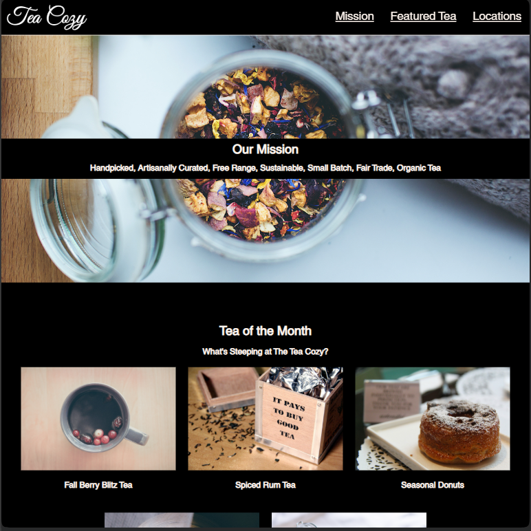

<p align="center">
  
</p>

<h1 align="center">🍵 Tea Cozy</h1>

<p align="center">
  A fictional tea shop website built as part of the Codecademy HTML & CSS learning projects.
</p>

<p align="center">
  
  
  
  
  
  
</p>

<p align="center">
  
  
</p>

<p align="center">
  <a href="https://amirabenameur3.github.io/Tea-Cozy/">
  
  </a>
</p>

---

## 📖 Project Overview

This project recreates a fictional tea shop website called **Tea Cozy**.

The goal of this project is to build a fully styled web page based on a design specification provided by Codecademy. It focuses on practicing **HTML structure, CSS styling, and layout techniques using Flexbox**.

The website showcases a fictional tea shop’s mission, featured teas, and store locations through a clean, structured, and visually engaging layout.

---

## ✨ Features

- Fixed navigation header
- Flexbox-based layout
- Product showcase section
- Location cards
- Background images
- Clean typography
- Responsive-friendly structure

---

## 🎬 Demo

<p align="center">
  
</p>

---

## 🧰 Technologies Used

- **HTML5**
- **CSS3**
- **Flexbox**
- **Git & GitHub Pages**

---

## 📸 Website Sections

### Hero / Mission Section
Highlights the tea shop philosophy and branding.

### Featured Tea
Displays the tea products of the month with images.

### Locations
Shows multiple shop locations using card-style layout.

### Footer
Contains contact and branding information.

---

## 📁 Project Structure

```
Tea-Cozy
│
├── index.html
├── README.md
├── tea_cozy_TC_favicon.ico
│
├── docs
│   ├── Tea_cozy_preview.png
│   ├── demo.gif
│   └── img-tea-cozy-redline.jpg
│
└── resources
    ├── css
    │   └── styles.css
    │
    └── images
```

---

## 🧠 What I Learned

While building this project I practiced:

- Structuring HTML layouts
- Using **Flexbox for page layout**
- Styling responsive web components
- Organizing assets in a real project structure
- Managing projects with **Git and GitHub**

---

## 🚀 Future Improvements

Possible improvements for this project:

- Improve mobile responsiveness
- Add animations and transitions
- Enhance accessibility
- Add interactive elements with JavaScript

---

## 👩‍💻 Author

**Amira Ben Ameur**

PhD researcher in Structural & Transportation Engineering  
Front-End Development learner

GitHub  
https://github.com/amirabenameur3

---

## 📌 Disclaimer

This website represents a **fictional tea shop website** created for **learning and portfolio purposes**.

It does **not represent a real company or brand**.

---

## ⭐ If you like the project

Consider giving the repository a **star on GitHub** ⭐
