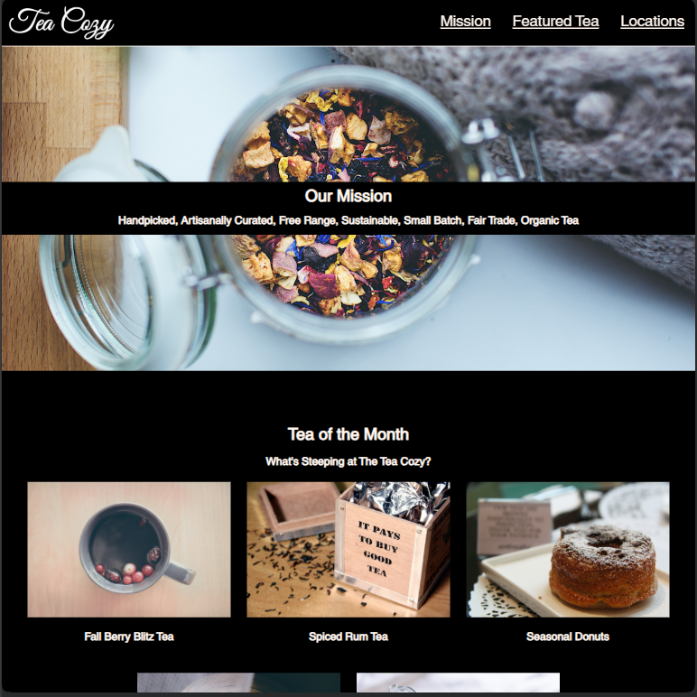

<p align="center">
  
</p>

<h1 align="center">🍵 Tea Cozy</h1>

<p align="center">
  A modern fictional tea shop website built as part of the Codecademy HTML & CSS learning projects.
</p>

<p align="center">
  
  
  
  
  
  
  
</p>

<p align="center">
  
  
  
</p>

<p align="center">
  <a href="https://amirabenameur3.github.io/Tea-Cozy/">
    
  </a>
</p>

---

## 📖 Project Overview

**Tea Cozy** is a fictional tea shop landing page inspired by a Codecademy front-end development project.

The objective of this project was to recreate a fully styled website from a design specification while practicing:

- Semantic HTML structure
- CSS styling techniques
- Flexbox layouts
- Responsive web design principles
- Project organization using Git & GitHub

The website presents the identity of a fictional tea company through visually structured sections featuring a mission statement, featured teas, and store locations.

---

## 🌐 Live Demo

You can explore the live version of the website here:

🔗 https://amirabenameur3.github.io/Tea-Cozy/

Deployed with **GitHub Pages**

---

## ✨ Features

- Sticky navigation header
- Responsive Flexbox layouts
- Featured tea showcase
- Location cards with overlay styling
- Full-width hero banner
- Background imagery integration
- Clean typography hierarchy
- Reusable utility classes
- Organized project structure
- GitHub Pages deployment

---

## 🎨 Highlights

- Improved visual polish and spacing system
- Better responsive behavior across screen sizes
- Refined card layouts and alignment
- Consistent section structure
- Cleaner CSS organization and maintainability
- Portfolio-ready presentation

---

## 🎬 Demo

<p align="center">
  
</p>

---

## 🧰 Technologies Used

- **HTML5**
- **CSS3**
- **Flexbox**
- **Git & GitHub Pages**

---

## 📸 Website Sections

### 🌿 Mission Section
Introduces the tea shop philosophy with a large hero-style banner.

### 🍵 Featured Tea
Displays tea products of the month using responsive image cards.

### 📍 Locations
Presents store locations with styled overlay cards.

### 📞 Contact Section
Provides branding and contact information.

### 🦶 Footer
Contains copyright information.

---

## 📁 Project Structure

```
Tea-Cozy
│
├── index.html
├── README.md
├── tea_cozy_TC_favicon.ico
│
├── docs
│   ├── Tea_cozy_preview.png
│   ├── demo.gif
│   └── img-tea-cozy-redline.jpg
│
└── resources
    ├── css
    │   └── styles.css
    │
    └── images
```

---

## 🧠 What I Learned

Through this project, I practiced:

- Building structured web layouts
- Creating responsive sections using Flexbox
- Managing spacing and alignment systems
- Organizing CSS for readability
- Working with reusable styles
- Improving visual consistency
- Deploying static websites with GitHub Pages
- Using Git branches and commits for workflow management

---

## 🚀 Future Improvements

Potential future upgrades include:

- Adding JavaScript interactivity
- Implementing animations and transitions
- Enhancing accessibility (ARIA & keyboard navigation)
- Improving mobile navigation experience
- Adding dark/light theme support
- Optimizing images and performance

---

## 👩‍💻 Author

**Amira Ben Ameur**

PhD Researcher in Structural & Transportation Engineering  
Front-End Development Learner

GitHub:  
https://github.com/amirabenameur3

---

## 📌 Disclaimer

This project represents a **fictional tea shop website** created for:

- Learning purposes
- Front-end practice
- Portfolio presentation

It does **not represent a real business or commercial brand**.

---

## ⭐ Support

If you enjoyed this project or found it inspiring, consider giving the repository a **star on GitHub** ⭐
